# AKARPROMAX — CROSS-FEATURE DEPENDENCY MAP
**Phase 0.5** · Derived from real imports and real SQL access, not from intent or documentation.
This map determines the future repair order in `IMPLEMENTATION-ORDER.md`.

---
Built from real `import` statements in `app/api/**` and `lib/**` (scanned, not assumed).
`==>` = hard import dependency. `-.->` = shared table name only, no import (a *latent* coupling).
`XX` = the edge the brief expected but which **does not exist in code**.

```mermaid
graph TD
  %% ============ RUNTIME / DB LAYER ============
  subgraph L["Data-access layers (5 parallel)"]
    PG_DIRECT["lib/db/index.ts<br/>Drizzle + postgres-js (direct)"]
    RTDB["lib/runtime-db.ts<br/>D1-interface shim"]
    PGRT["lib/pg-runtime.ts<br/>PgRuntimeDb : D1Database"]
    MYRT["lib/mysql-runtime.ts"]
    D1["cloudflare:workers env.DB"]
    MYDRZ["lib/mysql-db.ts<br/>Drizzle + mysql2"]
  end
  RTDB ==> PGRT
  RTDB ==> MYRT
  RTDB ==> D1
  PGRT ==> ENSURE["lib/content-schema.ts<br/>ensureContentSchema (22 tables)"]
  D1 ==> ENSURE
  MYRT ==> ENSMY["ensureMysqlSchema<br/>(omits company + integration)"]
  ENSURE ==> ENS2["ad-schema · i18n-schema · services-schema<br/>services-marketplace-schema · properties-schema<br/>company-schema · integration/schema · news/schema"]

  %% ============ IDENTITY ============
  subgraph I["Identity (1 session, 2 façades, 2 key spaces)"]
    SESSION["lib/auth/session.ts<br/>JWT cookie akar_session<br/>key = userId (uuid)"]
    IDAUTH["lib/identity-auth.ts<br/>key = email (string)"]
    SPAUTH["lib/sponsor-auth.ts<br/>@deprecated shim"]
  end
  SESSION ==> PG_DIRECT
  IDAUTH ==> SESSION
  IDAUTH ==> PG_DIRECT
  SPAUTH ==> IDAUTH
  IDAUTH ==> SVCID["lib/services/identity.ts<br/>augmentPermissionsForServiceProviderCapability"]

  %% ============ IDENTITY -> DOMAINS ============
  SESSION ==> PROPS["Properties<br/>app/api/properties/*"]
  SESSION ==> MSG["Messaging (Drizzle)<br/>app/api/messages/*"]
  SESSION ==> AUCT["Auctions<br/>app/api/auctions/*"]
  SESSION ==> COMM["Community<br/>app/api/community/*"]
  SESSION ==> KNOW["Knowledge<br/>app/api/knowledge/*"]
  SESSION ==> ORG["Companies / Offices<br/>app/api/companies · offices"]
  SESSION ==> AMRS["AMRS (orgs, verification, reputation)"]
  SESSION ==> CONTR["Contracts stub<br/>app/api/contracts"]
  SPAUTH ==> SVC["Services marketplace<br/>app/api/service-*, services/*"]
  SPAUTH ==> ADS["Ads<br/>app/api/ads/*, admin/ads/*"]
  SPAUTH ==> NEWS["News<br/>app/api/news/*"]
  SPAUTH ==> OFFICE["Office v1 integration"]
  SPAUTH ==> ADMAUD["Admin audit / stats / taxonomy"]
  IDAUTH ==> ADV["Advertisers + advertiser-*"]
  IDAUTH ==> OLINK["Office-links (licensing)"]

  %% ============ OWNERSHIP ============
  ORG ==> ORGMEM["organization_members<br/>(25 consuming files)"]
  ORGMEM ==> ORGBR["organization_branches"]
  PROPS -.->|"properties.userId = session.userId<br/>app/api/properties/[id]/route.ts:110,243"| ORGMEM
  AMRS ==> ORGMEM

  %% ============ MESSAGING / NOTIFICATIONS ============
  MSG ==> MSGT["message_threads · message_participants<br/>messages · message_attachments"]
  SVC ==> SVCMSG["service_message_threads<br/>service_message_participants"]
  SVC ==> SVCNOTIF["service_notifications<br/>lib/services/marketplace.ts:2085"]
  OFFICE ==> OFFNOTIF["office_notification_rules<br/>office_notification_deliveries"]
  MSG -.->|"3 parallel messaging impls (Phase-0 fact)"| SVCMSG

  %% ============ REALTIME ============
  OFFICE ==> RT["lib/integration/realtime.ts<br/>DbRealtimeTransport"]
  RT ==> RTT["office_realtime_events"]
  SSE["app/api/office/v1/stream<br/>SSE replay only"] ==> RT
  NOPUB["NO publisher: 0 callers of transport.publish()"] -.-> RT

  %% ============ GEO (4 parallel models, NOT a shared service) ============
  subgraph G["Geo — four incompatible models"]
    GEO_DB["lib/db/schemas/geo-schema.ts<br/>countries>governorates>cities>districts>streets (uuid FK)"]
    GEO_TXT["free-text country/governorate/city/district<br/>properties, property_requests, service_requests(pg)"]
    GEO_CODE["country_code + city_id + district_id (strings)<br/>sponsors, organizations, org_branches,<br/>services-marketplace, radar, ads"]
    GEO_STAT["src/data/locations.ts (232 L static)<br/>+ 13 files with inline const countries[]"]
    GEO_NOM["app/api/location/route.ts<br/>Nominatim reverse-geocode + Arabic name map"]
  end
  GEO_DB ==> GEOSVC["lib/services/geo/geo.service.ts"]
  GEOSVC ==> GEOAPI["app/api/geo/route.ts"]
  GEO_STAT ==> UI["LocationChip · AccountDialog · AdSlot<br/>admin/news client"]
  PROPS ==> GEO_TXT
  SVC ==> GEO_CODE
  ADS ==> GEO_CODE
  ADV ==> GEO_CODE
  OFFICE ==> GEO_CODE
  ORG ==> GEO_CODE
  GEO_DB -.->|"XX no import from Properties/Ads/Radar/Offices"| PROPS
  GEO_DB -.->|"XX"| ADS

  %% ============ LAND / GEO PIPELINE ============
  LAND["Land / FindMyLand<br/>app/api/land/*"] ==> GEOPIPE["lib/geo/* (21 imports from lib/land)"]
  LAND ==> LANDMEM["lib/land/saved-land.ts · quote.ts · resolve-store.ts<br/>(in-memory Maps)"]
  LAND ==> PG_DIRECT
  LAND ==> AMRSSEC["lib/amrs/security.ts (rate limit #2)"]

  %% ============ STORAGE ============
  subgraph S["Storage"]
    R2["lib/runtime-assets.ts → R2<br/>BROKEN under Node"]
    RAWURL["raw-URL text columns"]
    PHANTOM["app/api/office/v1/media<br/>synthetic URL, bytes discarded"]
    MEM["in-memory Maps"]
    PUBLIC["public/sponsors/*.webp"]
  end
  ADS ==> R2
  ADV ==> RAWURL
  PROPS ==> RAWURL
  ORG ==> RAWURL
  SVC ==> RAWURL
  LAND ==> RAWURL
  MSG -.->|"message_attachments: 0 consumers"| RAWURL
  OFFICE ==> PHANTOM
  PHANTOM -.-> PROPS
  ADV ==> PUBLIC
  LAND ==> MEM

  %% ============ OFFICE HUB ============
  OFFICE ==> ADSENG["lib/ads/engine.ts · context.ts · events.ts"]
  OFFICE ==> NEWSDEL["lib/integration/news.ts → lib/news/*"]
  OFFICE ==> RADAR["lib/integration/radar.ts"]
  OFFICE ==> SYNC["lib/integration/sync.ts"]
  OFFICE ==> PAIR["lib/integration/pairing.ts · device.ts · office-auth.ts"]
  OFFICE ==> AMRSWS["lib/amrs/workspace-profile-api.ts<br/>lib/amrs/workspace-branches-api.ts"]
  RADAR -.->|"raw SQL on properties table"| PROPS
  OFFICE ==> RTDB

  %% ============ AUDIT (2 trails) ============
  SESSION ==> SECAUD["lib/security/audit.ts → audit_events (Drizzle/PG)"]
  SVC ==> SVCAUD["lib/services/audit.ts → audit_logs (raw SQL)"]
  ADS ==> SVCAUD
  NEWS ==> SVCAUD
  ADV ==> SVCAUD
  ADMAUD ==> SECAUD
  SVCAUD -.->|"XX admin console never reads audit_logs"| ADMAUD
```



### Edges the brief expected — verified or refuted

| Expected edge | Verdict | Evidence |
|---|---|---|
| Identity → Ownership → Properties | **CONFIRMED, but via two disjoint key spaces.** `app/api/properties/[id]/route.ts:6` imports `getSession`; ownership is `existing.userId !== session.userId` (`:110`, `:243`) — a uuid. Organisation ownership is `organizationMembers` (`app/api/companies/[id]/profile/route.ts:66-71`) — also uuid. But the services/office/ads world keys ownership by **email** (`app/api/service-requests/[id]/attachments/route.ts:29` `String(serviceRequest.customer_user_id) === identity.email`). A property owner and a service customer can never be proven to be the same person. |
| Properties → Messaging | **WEAK.** `app/api/messages/route.ts` imports only `lib/db` + `messages-schema`; there is no import of `properties-schema`. The link is a free-text `context` on a thread. |
| Messaging → Notifications | **REFUTED as a single system.** Three independent notification stores exist and none imports another: `service_notifications` (`lib/services/marketplace.ts:2085-2103`), `office_notification_deliveries` (`lib/integration/notifications.ts`), and email (`lib/email.ts`). `app/api/messages/*` (the Drizzle messaging impl) writes to **none** of them. |
| Geo → {Properties, Services, Ads, Radar, Offices, Companies, Professionals} | **REFUTED.** `lib/db/schemas/geo-schema.ts` has exactly **one** importer: `lib/services/geo/geo.service.ts`, itself imported by exactly one route (`app/api/geo/route.ts`). Properties use free-text `country/governorate/city/district` (`lib/db/schemas/properties-schema.ts:16-19`); Ads/Radar/Offices/Companies/services-marketplace use `country_code`+`city_id` strings; the UI uses a static `src/data/locations.ts` (232 L) plus 13 inline `const countries` arrays; reverse-geocoding goes to Nominatim (`app/api/location/route.ts:5`). **Four+ parallel geo models, zero shared service.** |
| Storage → {Property media, Ads, Office media, Messaging attachments, Profiles} | **PARTIALLY REFUTED.** Only Ads reaches real storage (`app/api/ad-assets/route.ts:3` → R2, broken under Node). Property media, Office media, Messaging attachments and Profiles all resolve to S2 (raw URL text) or S3 (phantom URL). `message_attachments` (`lib/db/schemas/messages-schema.ts`) has **zero consumers**. |
| Identity → {Services, Auctions, Community, Knowledge, Vehicles} | **CONFIRMED for Auctions/Community/Knowledge** (`@/lib/auth/session`), **CONFIRMED via the deprecated shim for Services** (`@/lib/sponsor-auth`), **REFUTED for Vehicles**: `app/api/vehicles/route.ts` is a 4-line stub — `GET` returns `{success:true, data:[]}` unconditionally, with no session import, no db import, and no reference to the `vehicles` table that `lib/db/schemas/vehicle-schema.ts` declares. |
| Office ↔ {Properties, Ads, News, Radar, Notifications} | **CONFIRMED and the densest hub in the tree.** `app/api/office/**` imports `lib/ads/{context,engine,events}`, `lib/integration/{ads,news,radar,notifications,realtime,sync,pairing,device,office-auth,db,constants}`, `lib/amrs/workspace-{profile,branches}-api`, `lib/db`, `lib/db/schema`, `lib/runtime-db`, `lib/sponsor-auth`, `lib/security/{audit,rate-limit}` — **24 distinct module imports**, more than any other API subtree. Office → Properties is via raw SQL on the `properties` table (`app/api/office/v1/media/route.ts:45`, `lib/integration/radar.ts:71-77`), i.e. the D1 shim reaching into a Drizzle-owned table. |

### Additional real edges found (not in the brief)

1. `lib/land/*` → `lib/geo/*` — **21 import statements**, the single strongest module coupling in the tree.
2. `lib/land/*` → `lib/amrs/*` (4 imports: `lib/land/amrs-directory.ts`, `surveyor-discovery.ts`) — Land depends on the professional directory.
3. `lib/services/identity.ts` → `lib/identity-auth.ts` — services capability *augments the permission set* of the identity façade, so Identity depends on Services at runtime (a cycle: `identity-auth` → `services/identity` → back into role permissions).
4. `lib/auctions/policy.ts` → `verification_records` (`lib/db/schema.ts:189`) — Auctions depends on AMRS verification for eligibility.
5. `lib/command-center/service.ts` → `audit_logs`, `service_*`, `properties` — the admin command centre spans both DB layers in one module.

---


# Repair-order implications (infrastructure view)

Derived strictly from the graph above. Each item lists what it unblocks.

### Tier 0 — nothing else can be trusted until these are settled

| # | Must be fixed first | Why (graph-derived) | Unblocks |
|---|---|---|---|
| 0.1 | **Decide the single source of schema truth: `ensure*` raw SQL or Drizzle migrations.** | 75 tables are created by `ensure*` with no migration; 54 Drizzle tables have no creator at all; 8 table names are defined twice incompatibly. Every domain sits downstream of this. | Everything. No domain repair can be validated against a database whose shape is undefined. |
| 0.2 | **Resolve the 8 table-name collisions** (`ad_campaigns`, `ad_creatives`, `service_requests`, `service_offers`, `service_categories`, `service_reviews`, `auction_bids`, `auction_terms(+_acceptance)`). | `CREATE TABLE IF NOT EXISTS` silently gives the table to whichever schema boots first; the loser's queries reference non-existent columns. | Advertising (both engines), Services (both APIs), Auctions. |
| 0.3 | **Unify the ownership key space (uuid `userId` vs `email`).** | `lib/auth/session.ts` issues uuid; `lib/identity-auth.ts` exposes email and every services/office/ads route uses it as the user id. Cross-domain authorization is currently unprovable. | Identity → Ownership → Properties → Messaging → Notifications, and every authz defect in the Phase-0 list. |
| 0.4 | **Choose ONE data-access layer** (`lib/db` direct Drizzle vs `lib/runtime-db` D1 shim; retire `lib/mysql-db`, used by one route). | Five parallel layers; three of them can address the same physical Postgres database with different SQL dialects and different id types. | 0.1, 0.2, 0.3 and all of Tier 1. |

### Tier 1 — infrastructure that multiple domains sit on

| # | Fix | Depends on | Unblocks |
|---|---|---|---|
| 1.1 | **Server-side object storage that works on Node.** Replace/guard `lib/runtime-assets.ts:1-5`. | 0.4 (runtime detection already exists in `lib/pg-runtime.ts:22-31`; storage must adopt it) | Ad creatives (S1), advertiser logo upload (restores the capability lost per fragment 10 COMM-LEG-035), property media, office media, service attachments, provider documents, land documents, profile logos — **7 domains currently on raw URLs**. |
| 1.2 | **Create `office_media_upload_sessions`** or delete the code that writes it; **fix the `segments[2]` dispatch** and the unquoted `order` identifier in `app/api/office/v1/media/route.ts`. | 1.1 (a working store must exist before the route can be meaningful), 0.1 | Office → Properties media; the desktop↔web media bridge (S7 path↔URL mismatch). |
| 1.3 | **Move `saved-land` and `quote` off in-memory Maps** (`lib/land/saved-land.ts:3`, `lib/land/quote.ts:3`) and **add a session check to `app/api/land/route.ts:34,57`** (currently trusts a client-supplied `ownerId`). | 0.1 (a `land_parcels` creator must exist — the table has none), 0.3 | Land persistence, land sharing, surveyor quote leads. |
| 1.4 | **Consolidate the two rate limiters** (`lib/security/rate-limit.ts:65`, `lib/amrs/security.ts:32`) and the two caches (`lib/cache.ts:3`, `lib/cache/cache.service.ts:1`) onto shared state. | 0.4 | Identity brute-force protection, Office pairing/sync limits, AMRS/Geo/Land/News limits. |
| 1.5 | **Close the MySQL provider gap**: `lib/mysql-runtime.ts:630-649` must call `ensureCompanySchema` and `ensureIntegrationSchema`, or MySQL must be formally dropped as a provider. | 0.1 | Office/desktop integration and Companies taxonomy on MySQL. |
| 1.6 | **Point the admin audit console at both trails** (`app/api/admin/audit/route.ts:86-87` reads `audit_events`; `lib/services/audit.ts:13` writes `audit_logs`). | 0.4 | Admin, Advertising, News, Services, Commercial — every domain that logs an admin action. |

### Tier 2 — domain repairs, ordered by their in-edges

| # | Fix | Blocked by |
|---|---|---|
| 2.1 | **Geo consolidation** — pick one of the four models (`geo-schema` normalised tables, free-text columns, `country_code`/`city_id` strings, `src/data/locations.ts` static) | 0.1 (the `geo-schema` tables have no creator). Blocks Properties search, Services matching, Ads targeting, Radar, Offices, Companies, Professionals. |
| 2.2 | **Properties** — `properties` and its 7 sibling tables have no creator despite 83 consuming files | 0.1, 2.1 |
| 2.3 | **Messaging consolidation** (3 impls, Phase-0 fact) + `message_attachments` (0 consumers) | 0.3 (participant checks need one key space), 1.1 (attachments need real storage) |
| 2.4 | **Notifications consolidation** (3 unconnected stores) | 2.3 — notifications are triggered by messaging/services events |
| 2.5 | **Realtime** — `lib/integration/realtime.ts:26` `publish()` has **zero callers**; `app/api/office/v1/stream` can only replay an empty log | 0.1 (`office_realtime_events` is ensure-only), 2.4 (something must have events worth publishing) |
| 2.6 | **Advertising** — choose between `lib/ads/engine.ts` (759 L, D1 shim) and `lib/advertising/core/matching.engine.ts` (75 L, Drizzle) | 0.2 (`ad_campaigns` collision), 1.1 (creative storage) |
| 2.7 | **Services marketplace** — two APIs over two incompatible `service_requests` definitions | 0.2, 0.3 |
| 2.8 | **Contracts** — `lib/services/contracts/contract.service.ts:85,91` fabricates an id and a `fileUrl` that is never written; `app/api/contracts/route.ts` is POST-only | 0.1 (no contracts table exists), 1.1 (PDF needs storage) |
| 2.9 | **Commercial layer restore/retire** (fragment 10) — 7 orphaned tables, 3 inert permissions, deleted `sponsor_events` writer | 0.1, 0.4, 1.6 |
| 2.10 | **OAuth** (Phase-0: callbacks 500) — `user_oauth_accounts` has a migration and exactly one consumer (`lib/auth/oauth.ts`) | 0.3 (OAuth must produce the same identity key as password login) |

### Ordering rule extracted from the graph

> Nothing downstream of `lib/runtime-db.ts` or `lib/db/index.ts` can be repaired durably before
> 0.1–0.4, because **every** domain edge in the graph terminates at one of those two layers, and the
> two layers currently disagree about table shape, id type, dialect and identity key.
> The single highest-fan-in node is `ensureContentSchema` (`lib/content-schema.ts:567`), reached from
> both `lib/pg-runtime.ts:227` and `lib/runtime-db.ts:64`; the single highest-fan-out node is the
> Office API subtree (24 module imports).


# Per-domain dependency statements


## Identity, Profiles & Ranks (Domains A, B, C)

**This domain depends on:**
- PostgreSQL via `lib/db/index.ts` + the bootstrap DDL in `lib/db/pg-identity-schema.ts` (11 required tables). `DB_PROVIDER` defaults to `mysql` in `.env.example:18` while identity always uses `DATABASE_URL`/PG — a split-brain that Domain "Platform/Runtime" must resolve.
- `lib/config/runtime-env.ts` for `SESSION_SECRET`, `appOrigin`, `TRUSTED_ORIGINS` (fail-fast at module load in every auth route).
- `lib/email` + `lib/email/templates` for verification, welcome, OTP, reset and password-changed mail (Domain: Notifications).
- `lib/services/identity.ts` + the services D1-shim DB for provider capability and e-mail re-keying (Domain: Services).
- `lib/integration/*` and `office_device_credentials` for desktop device identity (Domain: Office integration).
- `lib/runtime-db.ts` / `lib/content-schema.ts` (D1-over-PG shim) for `sponsor_access`, `moderator_scopes`, `audit_logs`.

**Depends on this domain:**
- Every admin surface (`app/admin/*`) via `getSessionIdentity`/`hasPermission` and `src/components/PermissionGuard`.
- Services marketplace authorization (`tests/services-authz.test.mjs`), including provider-owned resources.
- Properties, auctions, community, knowledge, news, i18n, ads — all gate writes on `PERMISSIONS.*` from `src/constants/permissions.ts`.
- Messaging participant checks (already flagged defective in Phase 0) resolve identity through the same session.
- Office/company workspaces (`app/dashboard/office/*`, `app/dashboard/company/*`) resolve through `organization_members`.
- FindMyLand surveyor discovery (`app/api/land/discover-surveyors`) reads provider reputation/rank fields.


## Properties, Land, FindMyLand, Engineering Tools, Geo (Domains D, E, F, U, V)

- **Domain V (Geo) is a hard dependency of D, E, F and U.** Properties filter on `country/governorate/city/district` (`cur/app/api/properties/route.ts:57-60`); land parcels carry the same columns (`cur/lib/db/schemas/land-schema.ts:17-20`); FindMyLand's country adapter drives zone inference and plausibility (`cur/lib/land/intelligence/resolver.ts:98-113`, `cur/lib/land/intelligence/adapters.ts`); the coordinate converter and Points→DXF depend on the same proj4/zone conventions.
- **Ads / advertising** depend on geo for targeting and on properties for featured placements (`cur/lib/ads/geo.ts`, `cur/lib/advertising/core/matching.engine.ts`, `cur/components/advertising/placements/FeaturedProperties.tsx:23-37`).
- **Radar (office integration)** depends on geo distance and on the `property_listings` catalogue (`cur/lib/integration/radar.ts:60-99`) — cross-domain with Offices and Services.
- **Offices / Organizations** own `properties.office_id` and the property-request offer flow (`cur/app/api/property-requests/[id]/offers/route.ts:71-97` requires `organizationMembers` + `organizations.type='real_estate'` + `verifiedAt`).
- **Professionals / AMRS** back surveyor discovery for Land and FindMyLand (`cur/lib/land/amrs-directory.ts`, `cur/lib/land/integration/professional-integration.ts`).
- **Messaging** is the only contact channel from a property (`StartThreadButton`) and inherits the three parallel messaging implementations and the authorization defects listed in the Phase 0 baseline.
- **Auctions** are embedded in the property row (`cur/lib/db/schemas/properties-schema.ts:44-60`) and in offer-type policy (`allowAuction`/`allowFixedAuction`/`allowOpenAuction`), so Domain D changes cannot be made independently of the auctions domain.
- **Companies** currently have no property attachment path (PROP-043) — a decision here affects the Companies domain.


## AMRS, Surveyor Discovery, Organizations / Offices / Companies / Professionals (Domains G, H, M)

- **AMRS → Identity/Auth**: `getSession` (`lib/auth/session`) for member-scoped writes, `getSessionIdentity` + `hasPermission` (`lib/sponsor-auth`, `lib/identity-auth`) for admin reads; `lib/amrs/access.ts:4-10` reuses advertiser/user permissions. Blocked by the missing `organizations.*`/`verification.*` permissions.
- **AMRS → PostgreSQL**: `ensurePgIdentitySchema` (`lib/db/pg-identity-schema.ts:10-16`) must run before every AMRS route; `drizzle-pg/0003_legal_cerise.sql` + `drizzle-pg/0013_organizations_hardening_f1.sql` are the migrations of record.
- **AMRS → Services (D1)**: `lib/amrs/verification.ts:432-436` reads `service_provider_profiles` from `getServicesDb()`; `app/dashboard/company/services/page.tsx` joins PG members to D1 provider profiles. Cross-database join with no referential integrity.
- **Land/FindMyLand → AMRS**: `lib/land/amrs-directory.ts:1-2` (`searchDirectory`, `isMissingOrganizationsTableError`), `lib/land/surveyor-discovery.ts:2` (`REPUTATION_LEVELS`), `lib/land/contracts.ts:2` (`ReputationLevel`). Land's surveyor journey is fully blocked on AMRS-043/AMRS-044.
- **Non-AMRS consumers of `lib/amrs/security.ts`**: `app/api/land/{route,resolve,discover-surveyors}`, `app/api/geo/extract`, `app/api/news/sources{,/fetch}` — the AMRS rate limiter is used everywhere *except* AMRS.
- **Office/company workspaces → Properties**: `app/dashboard/office/{page,properties,property-requests}` join `properties.officeId` and `propertyRequestOffers.officeId` (`lib/db/schemas/properties-schema`).
- **Organizations → Advertising**: office/company/organization detail pages mount `AdSidebar`/`AdBottom`/`NewsTicker` with hard-coded geo (`app/offices/[id]/page.tsx:28-31`); `app/organizations/[id]/page.tsx:47` passes `entityType/entityId` to the ad layout.
- **Organizations → Admin roles**: `app/admin/roles` must publish `organizations.review` / `verification.review` before AMRS-013/AMRS-024 can be delegated.
- **Company taxonomy → runtime D1**: `lib/company-schema.ts:29-42` via `getRuntimeDb()`, separate from the PG organizations store.
- **Advertiser APIs → legacy `sponsor_*` tables** (`db/schema.ts`, `drizzle-mysql/0000_workable_the_initiative.sql`), which also still contain the six dropped commercial tables.

---


## Services Marketplace (Domain I)

- **Auth / identity** — `lib/identity-auth.ts:74-113` (`getSessionIdentity`), `lib/sponsor-auth.ts:14-28` (deprecated alias shim), `lib/auth/identity-map.ts:3-21`. Services store the **email** as `user_id`; any change to the identity key must be co-ordinated with `lib/services/identity.ts:44-76`. Blocks SVC-146, SVC-147, SVC-149.
- **RBAC** — `src/constants/permissions.ts:58-77`, `src/constants/roles.ts:57-68`, `lib/db/schemas/roles-schema.ts`. Blocks SVC-148/149/150.
- **Runtime DB adapter** — `lib/runtime-db.ts` via `lib/services/db.ts:22-24`; schema bootstrap `lib/mysql-runtime.ts:641-648` and `lib/content-schema.ts:590-609`. Everything in the domain depends on `ensureServicesSchema` + `ensureServicesMarketplaceSchema` running first. Blocks SVC-087/139.
- **Drizzle Postgres** — `lib/db/index.ts`, `drizzle-pg/*.sql`. `lib/db/schemas/services-schema.ts` has **no** corresponding migration, which is what breaks SVC-127/128 and dead-ends SVC-066.
- **Messaging domain (Domain: Messaging)** — services own the shared 7-context core; any messaging refactor must land SVC-113/115/116/118 together. See `docs/release/PHASE-0-BASELINE.md:475-481`.
- **Geo domain** — `lib/db/schemas/geo-schema.ts`, `lib/services/geo/geo.service.ts`, `/api/geo`. Required to turn the free-text `city_id` into a real reference (SVC-145/159).
- **Currency domain** — `lib/db/schemas/currency-schema.ts`, `lib/services/currency/currency.service.ts`, `/api/currencies`. Required for SVC-144/158.
- **Notifications / realtime** — nothing exists; SVC-107/110/152 depend on a platform decision (SSE/WebSocket) shared with Office and Auctions.
- **Media / uploads** — attachments (SVC-044), documents (SVC-016), portfolio (SVC-018) all take a bare URL today; they depend on the (currently broken, per `docs/release/PHASE-0-BASELINE.md`) media-upload pipeline.
- **Admin shell** — `app/admin/services/page.tsx`, `src/config/sidebar.ts`. Blocked by SVC-087/131.
- **i18n** — `src/data/translations.ts`, `lib/i18n/*`; category names are stored per-locale in the DB (`name_ar/en/tr`) while UI copy is in the translation catalogue — two localisation mechanisms in one screen.


## Messaging & Notifications (Domains J, K)

- **Auth / identity** — the email-vs-uuid split (MSG-056) is a consequence of two identity layers: `lib/identity-auth.ts:54` `getSessionIdentity` (email) vs `lib/auth/session.ts` `getSession` (uuid). `lib/sponsor-auth.ts:24` merely re-exports the former. Unifying messaging requires Domain A to settle the canonical user key first.
- **Properties** — MSG-002 cannot be fixed without a stable listing-owner user reference to derive the implicit participant from.
- **Services marketplace** — `request`/`order` threads derive participants from `service_requests`, `service_offers`, `service_orders` (`lib/services/marketplace.ts:1917-1932`); the MSG-010 offer-thread fix touches the offer lifecycle.
- **Organizations** — MSG-014 depends on `app/organizations/[id]/page.tsx` adopting the dead `organization-profile-page.tsx` component, or on that component's messaging block being ported.
- **Office integration** — NOTIF-009/010/015/018/032 all depend on `lib/integration/realtime.ts` gaining a publisher and `app/api/office/v1/stream/route.ts` gaining a subscription loop (Phase 0 P1-2).
- **Email infrastructure** — NOTIF-014 depends on `lib/email/templates.ts` gaining non-auth kinds and on SMTP being production-configured (`lib/email.ts:5-11` `EmailRuntimeStatus.productionCapable`).
- **PWA / storage** — NOTIF-016 depends on a `sw.js` that does not exist; MSG-028 depends on the R2→Node storage fix (Phase 0 P1-3).
- **Admin / moderation** — MSG-032 and MSG-041 depend on `REPORT_TARGETS` (`lib/services/marketplace.ts:1650`) and `moderateTarget` (`:1714`) gaining message actions.
- **Saved searches / radar / auctions** — NOTIF-035, NOTIF-033, NOTIF-029 each need an emitter added in their own domain, not in Domain K.
- **Test harness** — every messaging fix should extend `tests/messages-contract.test.mjs`, whose line 81-83 currently asserts the leaking behaviour and must be inverted alongside the fix.

---


## Auctions, Community, Knowledge, Vehicles, News (Domains L, N, O, P, Q)

- **Auctions → Properties.** The canonical auction *is* a property row: `properties.auction_*` (`lib/db/schemas/properties-schema.ts:44-60`), `auction_bids.property_id`. Any Properties-domain change to approval status or `property_offers` changes auction eligibility (`app/api/auctions/route.ts:167`, `:173-193`).
- **Auctions → Offer types.** `property_offer_types.allow_fixed_auction` / `allow_open_auction` gate auction type (`app/api/auctions/route.ts:192-193`); admin surface `app/admin/offer-types/page.tsx`.
- **Auctions → Organizations / AMRS.** `getClosedAuctionOrganizer` depends on `organizations.status`, `organizations.type`, `organization_members.role/status` and `verification_records` (`lib/auctions/policy.ts:96-129`). An organisation losing verification silently strips auction-organizer rights.
- **Auctions → Identity / RBAC.** `session.role === 'super_admin'` and `permissions.includes('*')` are used directly rather than a named permission (`app/api/auctions/[id]/end/route.ts:35`, `contract/route.ts:29`, `app/api/admin/auction-organizers/route.ts:13`) — inconsistent with the permission-matrix approach used by News.
- **Auctions → Notifications / Realtime.** Both dependencies are declared by product intent and **absent** in code; `lib/integration/notifications.ts` exists for the Office channel but is not wired to auctions.
- **Community / Knowledge → Identity.** FK to `users` for `user_id` / `uploaded_by`, but no join is ever performed for display (COMM-013).
- **Community / Knowledge / Vehicles → Advertising.** All three declare ad layouts (`src/config/public-ad-policy.ts:31-32`, `src/constants/advertising.ts:51-52`) and mount `AdSidebar`/`AdBottom`/`NewsTicker`, so the ad-family taxonomy must keep `community` and `knowledge` families; `/vehicles/[id]` currently borrows the `knowledge` family (VEH-016).
- **News → runtime DB seam.** `lib/news/db.ts` → `lib/runtime-db.ts` → `lib/pg-runtime.ts` (SQL dialect translation at `:78`) or `lib/mysql-runtime.ts`. News is the heaviest consumer of this seam; retiring it would require porting `lib/news/*` to Drizzle.
- **News → Sponsor auth / permissions.** `lib/sponsor-auth.ts` (`getSponsorIdentity`, `hasSponsorPermission`, `canManageCountry`) plus `src/constants/permissions.ts:28-34`.
- **News → Office integration.** `app/api/office/v1/news/route.ts` depends on `lib/integration/office-auth.ts` (device token + `office.news.read` scope) and on the `office_news_deliveries` table via `lib/integration/db.ts`.
- **News → Advertising engine (unintended).** The second ticker couples News to `lib/advertising/core/matching.engine.ts` and `news_ticker_items`; resolving NEWS-031 requires an Advertising-domain decision.
- **All five domains → migration set.** `drizzle-pg/` is missing `0004`–`0006` and `drizzle.config.ts` is out of sync with the live auction schema; both must be fixed before any schema work in these domains.


## Advertising, Currency, Localization (Domains R, W, X)

- **ADS → Identity/RBAC.** `cur/lib/sponsor-auth.ts` (`getSponsorIdentity`/`hasSponsorPermission`) gates `/api/admin/ads*`, `/api/ad-assets`; `cur/lib/identity-auth.ts` (`getSessionIdentity`/`hasPermission`) gates `/api/advertiser*`. **Two different identity helpers guard the same domain** — see AUTH domain.
- **ADS → Storage.** All creative upload/serve paths depend on `cur/lib/runtime-assets.ts:1-5` (R2 via `cloudflare:workers`). Nothing in ADS can be exercised until the runtime/storage decision lands.
- **ADS → Geo.** Country/region/city/district targeting (`engine.ts:374-400`) consumes IDs that must match `cur/lib/db/schemas/geo-schema.ts`; `AdSlot` passes only `country` + `city` (`AdSlot.tsx:185-186`), never region/district/lat/lng.
- **ADS → Office integration.** `cur/lib/integration/office-auth.ts` + `cur/lib/integration/constants.ts:35-52` (device token, `office.ads.read` scope) — see the Office/Integration domain.
- **ADS → Audit.** `audit_logs` writes at `app/api/ad-assets/route.ts:174,226`, `app/api/admin/ads/approve/route.ts:54`, `app/api/ads/request/route.ts:179`, `app/api/advertisers/route.ts:104`; **no read surface** (ADS-020).
- **ADS → Notifications.** None. Ad approval/rejection (`admin/ads/approve/route.ts`) sends nothing to the requester — see the Notifications domain.
- **ADS → Realtime.** None; no ads event is published on any channel.
- **CUR → Geo.** `currencies.code` ↔ `geo countries.currency_code` (`geo-schema.ts:12`) and `GeoContext.CountryConfig.currencyCode` (`GeoContext.tsx:25`).
- **CUR → Properties / Services.** Property `currency` (`PropertyForm.tsx:30`) and services request/offer/job currency columns must validate against the `currencies` catalogue; today neither does.
- **CUR → Migrations.** `drizzle-pg/0009_add_geo_currency.sql` is referenced but absent (CUR-015) — blocks any currency work until the migration set is reconciled.
- **I18N → every UI domain.** Unblocking I18N-014 means migrating `copy`-consuming pages onto `t()`; that touches Properties, Services, Auctions, Community, Knowledge, Tools and Admin.
- **I18N → RBAC.** `I18N_VIEW/EDIT/PUBLISH` (`cur/src/constants/permissions.ts:81-84`) checked through `hasSponsorPermission`, while sibling admin consoles use `hasPermission` — same split as ADS.
- **I18N → Desktop.** `AkarApp_LIVE/Localization/LocalizationManager.cs` reads bundled JSON; any shared-store ambition requires a desktop release channel (I18N-026).
- **I18N → Ads.** Ad copy is locale-column-based (`ad_campaigns.*_ar/_en/_tr`) and read with no empty-value fallback (`engine.ts:684-688`, I18N-025).


## AkarProMax Office / AkarApp_LIVE & Radar (Domains S, T)

- **Domain A — Identity/Auth**: `getSponsorIdentity` / `hasSponsorPermission` gate pairing, devices and admin overview; `getSession` gates the office workspace and `POST /api/properties`. `sponsor_id` is derived from `identity.email` (OFFICE-019). The Phase-0 OAuth breakage does not touch these paths but does touch any office user who signed up via Google/Facebook.
- **Domain B — Properties**: `property_listings` (sync + radar) vs `properties`/`property_media` (workspace, public site, media route). OFFICE-098, OFFICE-054, RADAR-009 all resolve inside Properties.
- **Domain — Ads**: `lib/ads/{engine,context,events,track,types}.ts`, `ad_campaigns.channels`, `src/constants/advertising.ts:215-219`, and the Phase-0 "ad-creative storage broken under Node" defect (`lib/runtime-assets.ts:2`).
- **Domain — News**: `lib/news/{delivery,contracts,schema}.ts`; office news is a channel of the platform news system (`OFFICE_NEWS`, `OFFICE_TICKER`).
- **Domain K — Notifications**: `lib/integration/notifications.ts` is a *second*, office-specific notification system, disjoint from the platform notification code. Any consolidation decision must cover both.
- **Domain — Services**: radar `kind: "services"` reads `service_provider_profiles` (`lib/integration/radar.ts:104-107`).
- **Domain — AMRS/Organizations**: `lib/amrs/workspace.ts`, `workspace-profile-api`, `workspace-branches-api` back the office profile/branches/members tabs; `organizations`/`organization_members` define office membership.
- **Runtime**: `lib/runtime-db.ts` (D1 / MySQL shim) vs `lib/db` (PostgreSQL Drizzle). The office integration straddles both; `lib/content-schema.ts:594` is the only caller of `ensureIntegrationSchema`.
- **Security**: `lib/security/rate-limit.ts` (pairing-complete, sync-push), `lib/security/audit.ts` (all office events).
- **Tests**: `package.json:13` runs the 7 `tests/integrations-*.test.mjs` files. No test exists for `app/api/office/v1/media`, `.../ads`, or `.../auth`.

---


## Admin, Analytics, Search, Favorites, Reviews (Domains AB, AC, AA, Y, Z)

- **AB → Identity (Domain A):** every admin gate resolves through `getSessionIdentity`
  (`lib/identity-auth.ts:54`) and `permissionsForSessionRole` (`lib/auth/identity-map.ts:16`).
  Fixing ADMIN-005/006 requires the identity domain to own role assignment.
- **AB → Services (Domain D):** `/admin/services`, disputes, reports and review moderation all sit
  on `lib/services/marketplace.ts`. ADMIN-021/022 and REV-010 cannot be fixed independently.
- **AB → Ads/Advertisers:** ADMIN-031..040 and ANLY-005..009 share `ad_campaigns`/`ad_events`;
  the R2 defect (ADMIN-033) is a Phase-0 platform issue, not an admin issue.
- **AB → Office integration (Domain H):** `/admin/integration` and the command-centre integration
  section depend on `lib/integration/*`; the realtime "health" heuristic
  (`command-center/service.ts:391`) will stay wrong until something actually publishes realtime.
- **AC → AB:** every analytics surface is an admin page; ANLY-008 must be fixed before ADMIN-023
  can be marked FULL.
- **AC → News (Domain G):** news analytics is the only complete loop and is the reference pattern
  for the others.
- **AA → Properties (Domain C) / Land (Domain E):** search quality is bounded by the schema
  (free-text `city`, no normalised geo). SRCH-001/002 depend on ADMIN-050 (geo admin) to give the
  filters a canonical vocabulary.
- **AA → Notifications (Domain K):** SRCH-017 needs the notification transport that Domain K
  reports as in-app-only.
- **Y → Identity:** FAV-013 (guest→account merge) depends on `lib/services/identity.ts:63`
  being extended to `property_favorites` and `land_favorites`.
- **Y → Land (Domain E):** FAV-011 is blocked on replacing the in-memory `saved-land` store with
  the `land_parcels`/`land_favorites` tables that already exist.
- **Z → AMRS (Domain F):** REV-013/014 require one reputation engine before reviews can drive rank.
- **Z → Messaging (Domain J):** ADMIN-047 (report a message) needs `REPORT_TARGETS`
  (`marketplace.ts:1650`) extended, which is a messaging-domain change.

---


---

# PART II — ROUND 2: THE NINE KERNELS AND THE THREE-GENERATION GRAPH

Added 19 Aug 2026 after the actual V1 source and the actual AkarProMax Office C# source became available.
Part I above (derived from real V2 imports and real SQL access) is unchanged.

## 1. Kernel dependency graph

The nine kernels defined in `AKARPROMAX-PRODUCT-CONSTITUTION.md` Article 8 depend on each other in exactly
one direction. An arrow means "cannot be correct until".

```
IDENTITY_ACCESS
   │
   ├──► ORGANIZATIONS_OWNERSHIP ──► TRUST_REPUTATION_VERIFICATION
   │            │                            │
   │            ▼                            ▼
   │        MESSAGING ◄──────────── MODERATION_AUDIT_SAFETY
   │            │                            ▲
   │            ▼                            │
   │     EVENTS_NOTIFICATIONS ───────────────┘
   │
   ├──► GEO_INTELLIGENCE ──► ADVERTISING
   │
   └──► STORAGE_MEDIA ──► (MESSAGING attachments · ADVERTISING creatives · property/office media)
```

Reading of the graph:

- **`IDENTITY_ACCESS` has no upstream and everything downstream.** Nothing else can be proven correct while
  four identity key spaces coexist.
- **`MESSAGING` sits below both `ORGANIZATIONS_OWNERSHIP` and `STORAGE_MEDIA`.** Participant resolution needs
  ownership; attachments need real storage. That is why messaging *consolidation* cannot precede either,
  even though the messaging *security* holes are fixed first as an emergency.
- **`MODERATION_AUDIT_SAFETY` is bidirectional with `MESSAGING`**: moderation needs message access, and
  messaging needs the moderation access log that V1 already had.
- **`ADVERTISING` sits below `GEO_INTELLIGENCE`** — V1's country/governorate/city/village targeting and V2's
  geo targeting are the same dependency.
- **`EVENTS_NOTIFICATIONS` is a sink**: nothing depends on it, it depends on almost everything. It is
  therefore repaired late, but designed early, because every domain declares events into it.

## 2. Domain → kernel consumption matrix

| Domain | IDENTITY | ORGS | TRUST | MESSAGING | EVENTS | MODERATION | GEO | ADS | STORAGE |
|---|---|---|---|---|---|---|---|---|---|
| Properties | ● | ● | ● | ● | ● | ● | ● | ● | ● |
| Land / FindMyLand / MapMyDeed | ● | ○ | ○ | ● | ● | ○ | ● | ○ | ● |
| Services Marketplace | ● | ● | ● | ● | ● | ● | ● | ○ | ● |
| Urgent Dispatch (V1 DNA) | ● | ● | ● | ● | ● | ● | ● | ○ | ○ |
| Tenders (V1 DNA) | ● | ● | ● | ● | ● | ● | ● | ○ | ● |
| Auctions | ● | ● | ● | ● | ● | ● | ● | ○ | ● |
| Organizations / Offices / Companies | ● | ● | ● | ● | ● | ● | ● | ● | ● |
| Marketers / Partners / Suppliers (V1 DNA) | ● | ● | ● | ● | ● | ● | ● | ○ | ● |
| Advertising | ● | ● | ○ | ○ | ● | ● | ● | ● | ● |
| News / Knowledge / Community / Blog | ● | ○ | ○ | ○ | ● | ● | ○ | ● | ● |
| Support / Tickets (V1 DNA) | ● | ● | ○ | ● | ● | ● | ○ | ○ | ● |
| Engineering platform (V1 DNA) | ● | ● | ○ | ● | ● | ○ | ● | ○ | ● |
| Software licensing / downloads (V1 DNA) | ● | ● | ○ | ○ | ● | ○ | ○ | ○ | ● |
| Admin & Analytics | ● | ● | ● | ● | ● | ● | ● | ● | ● |
| **AkarProMax Office (desktop)** | ● | ● | ● | ○ | ● | ○ | ● | ● | ● |

● = hard dependency · ○ = optional or indirect

## 3. The desktop's place in the graph

The desktop is **not** a leaf. It consumes six kernels and, uniquely, is the only generation that already
implements `ROLE → PERMISSION → ENTITY SCOPE` end-to-end (`Users.Permissions` carries a
`branch:<id>:<name>` scope token; `UserRolePermissions` is a real grant table; `AppSession` applies the
scope). Any `IDENTITY_ACCESS` design that cannot express a branch-scoped grant is a regression against the
desktop.

Two desktop dependencies have no web counterpart at all and must be designed, not merely connected:

- **Licensing / activation / subscription** — `LicenseService`, `OfflineLicenseService`, `ActivationThrottle`,
  `HwidGenerator`, `AppIntegrityService`, `SubscriptionService`. V1 had a server side
  (`server/api/src/routes/licenses.ts`, `desktop.ts`); V2 has none.
- **Office finance** — treasury, agency ledger, client ledger, installments, post-dated checks, commissions,
  vouchers, receipts, tax/fee types. Nothing in either web generation touches this.

## 4. Data-flow dependencies that cross generations

```
Desktop AkarDB.sqlite ──(CloudSyncQueue, never read by any code)──►  ✗ nothing
Desktop OfficeApiClient ──► V2 /api/office/v1/pairing/complete ──► ✗ 400 (PascalCase vs camelCase)
Desktop SubscriptionService ──► V1 /api/desktop/subscription-status ──► ✓ field-perfect match
Desktop WebsiteLoginDialog ──► V1 /auth/login (token) ──► ✓   |   V2 /api/auth/login (cookie) ──► ✗
Desktop RadarService ──(RadarMatches.ClientRequestId, no discriminator)──► ambiguous local/website ids
V2 office sync ──► property_listings (D1/MySQL)   ✗ never reconciled with   properties (PostgreSQL)
```

Every ✗ above is a dependency that must be resolved before the Office contract can be called working.

## 5. Repair-order consequences

1. `IDENTITY_ACCESS` before every domain — and before OAuth, because a federated login must produce the same
   identity as a password login.
2. `STORAGE_MEDIA` and `GEO_INTELLIGENCE` before Properties, Services, Advertising and Radar — nine and seven
   consumers respectively.
3. `MESSAGING` consolidation after `ORGANIZATIONS_OWNERSHIP` and `STORAGE_MEDIA`; messaging *security* fixes
   before both, as an emergency, with regression tests written first.
4. `MODERATION_AUDIT_SAFETY` alongside `MESSAGING`, not after it — V1's moderation access log is part of the
   messaging contract, not an add-on.
5. `ADVERTISING` engine unification after `GEO_INTELLIGENCE` and `STORAGE_MEDIA`.
6. The Office contract after `IDENTITY_ACCESS`, because pairing, licensing and the portal token handoff are
   all identity problems wearing an integration costume.
