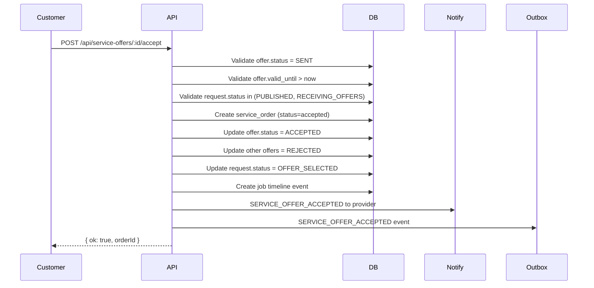

# Service Offer Policy

## Offer Lifecycle

```
SENT
  │
  ├──► ACCEPTED (customer accepts)
  │
  ├──► REJECTED (customer declines)
  │
  ├──► WITHDRAWN (provider withdraws)
  │
  ├──► REVISED (provider updates)
  │       │
  │       └──► (back to SENT)
  │
  └──► EXPIRED (past valid_until)
```

## Offer States

| State | Description | Who Can Enter | Valid Next States |
|-------|-------------|---------------|-------------------|
| `SENT` | Offer submitted, awaiting response | Provider | `ACCEPTED`, `REJECTED`, `WITHDRAWN`, `REVISED`, `EXPIRED` |
| `ACCEPTED` | Customer accepted offer | Customer | (terminal) |
| `REJECTED` | Customer declined offer | Customer | (terminal) |
| `WITHDRAWN` | Provider withdrew offer | Provider | (terminal) |
| `REVISED` | Provider updated offer | Provider | `SENT` |
| `EXPIRED` | Past `valid_until` date | System | (terminal) |

## Offer Rules

### Eligibility
- Provider must have `status = "approved"` profile
- Provider must offer the request's category
- Provider must be within service radius
- Provider cannot have existing active offer on same request (enforced by unique index)

### Offer Structure
```typescript
interface NewOfferFull {
  requestId: string;
  providerUserId: string;
  price?: number;           // base labor price
  currency?: string;        // default "OMR"
  durationDays?: number;    // estimated duration
  materialsIncluded?: boolean;
  materialCost?: number;    // materials cost
  laborCost?: number;       // labor breakdown
  visitFee?: number;        // site visit fee
  taxAmount?: number;       // tax
  totalPrice?: number;      // computed if not provided
  durationText?: string;    // human-readable "30 days"
  nearestDate?: string;     // earliest start date
  offerNotes?: string;      // description
  terms?: string;           // terms & conditions
  validUntil?: string;      // ISO date, after which offer expires
  needsVisit?: boolean;     // requires site visit
}
```

### Price Calculation
```typescript
function computeTotal(input): { total: number; price: number } {
  const price = input.price ?? 0;
  const total = price
    + (input.materialCost ?? 0)
    + (input.visitFee ?? 0)
    + (input.taxAmount ?? 0);
  return { total: Math.round(total), price: Math.round(price) };
}
```
- `totalPrice` = `price` + `materialCost` + `visitFee` + `taxAmount`
- `laborCost` is informational (part of `price`)
- All amounts in base currency units (baisa for OMR)

### Offer Revisions
- Each revision creates `service_offer_revisions` record
- Revision number auto-increments
- Original offer updated in place, history preserved
- Only provider who created offer can revise
- Can only revise while status = `SENT`
- Revision reason optional but recommended

### Acceptance Flow


### Concurrent Acceptance Prevention
- Unique index on `service_orders(request_id, offer_id)`
- Transaction ensures atomicity
- Other offers auto-rejected in same transaction

### Expiration
- `validUntil` optional, defaults to 7 days if not set
- System job runs hourly to expire offers:
  ```sql
  UPDATE service_offers
  SET status = 'expired', updated_at = now()
  WHERE status = 'sent' AND valid_until < now();
  ```
- Expired offers cannot be accepted

### Withdrawal
- Provider can withdraw while `status = SENT`
- Sets `status = WITHDRAWN`
- Offer removed from customer's view
- Cannot be reinstated (must create new offer)

### Rejection
- Customer can reject while `status = SENT`
- Sets `status = REJECTED`
- Offer removed from active view
- Cannot be reinstated

### Expiration Handling
- Offers with `valid_until` in past auto-expire
- System job runs every hour
- Expired offers excluded from customer view
- Provider notified via notification

## API Endpoints

| Endpoint | Method | Description |
|----------|--------|-------------|
| `GET /api/service-offers` | GET | List offers (filters: mine, limit) |
| `POST /api/service-offers` | POST | Create offer |
| `GET /api/service-offers/[id]` | GET | Get offer with revisions |
| `PATCH /api/service-offers/[id]` | PATCH | Actions: accept, decline, revise, withdraw |
| `POST /api/service-offers/[id]/accept` | POST | Accept offer |
| `POST /api/service-offers/[id]/decline` | POST | Decline offer |
| `POST /api/service-offers/[id]/revise` | POST | Revise offer |
| `POST /api/service-offers/[id]/withdraw` | POST | Withdraw offer |

## Authorization

| Action | Required Permission | Owner Check |
|--------|---------------------|-------------|
| Create offer | `SERVICES_CREATE` + `SERVICE_OFFERS_MANAGE_OWN` | Provider must be approved |
| View own offers | `SERVICE_OFFERS_MANAGE_OWN` | `provider_user_id = userId` |
| View request's offers | `SERVICES_VIEW` | Customer or provider on request |
| Accept/Decline | `SERVICE_OFFERS_MANAGE_OWN` | Customer only |
| Revise | `SERVICE_OFFERS_MANAGE_OWN` | Provider only (own offer) |
| Withdraw | `SERVICE_OFFERS_MANAGE_OWN` | Provider only (own offer) |

## Notifications

| Event | Type | Recipient | Payload |
|-------|------|-----------|---------|
| Offer created | `SERVICE_OFFER_RECEIVED` | Customer | requestId, offerId, providerName |
| Offer revised | `SERVICE_OFFER_REVISED` | Customer | offerId, revisionNumber |
| Offer accepted | `SERVICE_OFFER_ACCEPTED` | Provider | orderId, requestId |
| Offer accepted | `SERVICE_OFFER_ACCEPTED` | Customer | orderId |
| Offer rejected | `SERVICE_OFFER_REJECTED` | Provider | requestId |
| Offer withdrawn | `SERVICE_OFFER_WITHDRAWN` | Customer | requestId |
| Offer expired | `SERVICE_OFFER_EXPIRED` | Provider | offerId |

## Audit Events

| Action | Entity | Metadata |
|--------|--------|----------|
| `service_offer.create` | service_offers | requestId |
| `service_offer.revise` | service_offers | revisionNumber |
| `service_offer.accept` | service_orders | offerId, requestId |
| `service_offer.decline` | service_offers | offerId |
| `service_offer.withdraw` | service_offers | offerId |
| `service_offer.expire` | service_offers | offerId |

## Testing

See `tests/services-marketplace.test.mjs`:
- Valid offer creation
- Duplicate offer prevention
- Eligibility checks (category, radius, approval)
- Customer sees own request's offers
- Provider sees own offers
- Customer accepts one offer
- Second acceptance prevented
- Accepted offer immutable
- Notifications created
- Expired offers rejected
- Revision history preserved