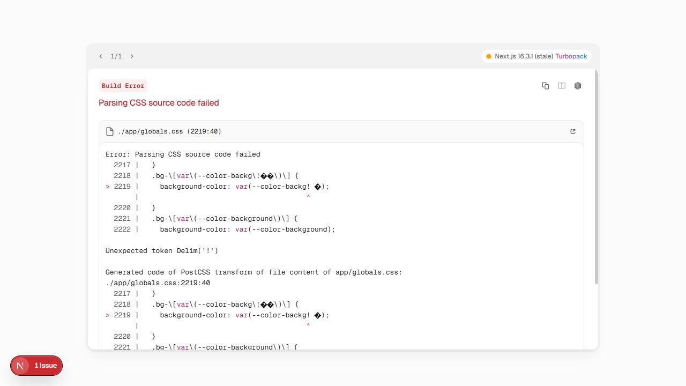

# PASS C.S — SERVICES REBUILD CERTIFICATION

**Audit date:** 2026-08-22  
**Runtime Candidate:** `http://localhost:3014` only  
**Database:** two disposable local PostgreSQL 18 databases on `127.0.0.1:55432`  
**Production Data Modified:** NO  
**Product Source Modified by PASS C.S:** NO  
**Certification artifacts created:** this report and `PASS_C_S_RUNTIME_3014.png`

## Certification Decision

| Required result | Decision |
|---|---|
| Services E2E | **FAIL** |
| RFQ lifecycle | **FAIL** |
| Direct booking | **FAIL** |
| Privacy API audit | **FAIL** |
| Authorization matrix | **PARTIAL** |
| Fresh PostgreSQL bootstrap #1 | **FAIL** |
| Fresh PostgreSQL bootstrap #2 | **FAIL** |
| Services classification | **BROKEN** |
| Production Data Modified | **NO** |
| FINAL | **PASS C.S = OPEN** |

`3012` was not used. No production endpoint, remote Neon database, production account, production row, or production credential was used.

## Scope and Test Controls

- The configured remote PostgreSQL target was explicitly excluded.
- A disposable local PostgreSQL cluster was used with two separately created empty databases: `pass_cs_bootstrap_1` and `pass_cs_bootstrap_2`.
- Each database had **0 public tables** before the official bootstrap attempt.
- `SEED_DEMO_DATA=false`; no demo or production rows were imported.
- The only synthetic privacy fixtures used `example.test` identities and existed in an in-memory test database.
- No manual SQL schema workaround was applied. SQL was used only for read-only evidence counts after the official bootstrap.
- The runtime and databases were tested only through the current project and the canonical bootstrap script.
- No feature was added and no refactor or defect correction was performed.

## Runtime Candidate Gate

`GET http://localhost:3014/services` returned **HTTP 500**. Removing the generated `.next/dev` cache and starting a clean development compilation reproduced the same failure.

The browser displayed the Next.js build error below:



The primary error is a PostCSS parse failure in generated CSS:

```text
./app/globals.css:2219:40
Parsing CSS source code failed
background-color: var(--color-backg!\0�);
Unexpected token Delim('!')
```

Additional generated utilities contained malformed values for `--color-surface`, `--layer-*`, and other arbitrary-value classes. A strict UTF-8/control-character scan of all `app/**/*.{js,jsx,ts,tsx}` and `src/**/*.{js,jsx,ts,tsx}` inputs found no invalid UTF-8, NUL, or forbidden control bytes. The confirmed failure boundary is therefore the Tailwind/PostCSS-generated CSS used by the runtime. The originating transform/scanner defect was not changed or masked during this certification.

The official Services integration test against `3014` produced:

| Check | Expected | Actual |
|---|---:|---:|
| Public service categories | 200 | **500** |
| Guest access to Services admin | 401 | **500** |
| Guest provider-status update | 401/403 | **500** |
| Integration-test total | 4 tests | **1 pass / 3 fail** |

Because the candidate cannot serve the page or API authorization responses, account creation and every authenticated browser lifecycle are blocked before the first business step.

## Services End-to-End Lifecycle

| Required stage | Runtime evidence | Result |
|---|---|---|
| Guest visits marketplace | `/services` returns 500 | FAIL |
| Craftsman/provider registration | Registration UI/API cannot be reached reliably through the candidate | BLOCKED |
| Provider application submission | Candidate compilation fails before route behavior | BLOCKED |
| Moderator/admin approval | Provider-status route returns 500 before its expected auth result | BLOCKED |
| Approved provider visibility | Public catalog/provider APIs return 500 in candidate | BLOCKED |
| Search by profession and location | Marketplace cannot render or return catalog data | BLOCKED |
| Customer creates request | Authenticated lifecycle cannot start | BLOCKED |
| Matching | No runtime request exists to match | BLOCKED |
| Provider offer | No matched runtime request exists | BLOCKED |
| Customer accepts offer | No runtime offer exists | BLOCKED |
| Order progression and completion | No runtime order exists | BLOCKED |
| Verified review | No completed runtime order exists | BLOCKED |

Static/domain tests prove that many intended operations exist, but they cannot substitute for the requested E2E certification. The isolated Services suite completed **126 tests: 124 pass, 2 fail**. One failure is the service-category CRUD lifecycle (`0 !== 1` after create/list), and one is a forward-migration journal guard whose expectation stops at `0002` while the current journal contains `0003`, `0004`, and `0005`.

**Services E2E: FAIL.**

## RFQ Lifecycle

The code contains the intended request → publish → matching → offer → accept → order path, and isolated matching/ownership tests pass. The complete RFQ path could not be executed on `3014` because the public catalog and authenticated endpoints fail at the build boundary with HTTP 500.

No request, offer, order, or review row was fabricated directly in PostgreSQL to claim an E2E pass.

**RFQ lifecycle: FAIL.**

## Direct Booking

Direct booking is presented in the UI and taxonomy through `booking_mode = instant|both`, but no booking/reservation/appointment API exists under `app/api`. The request wizard only maps an instant category to `pricingType: "fixed"`, then still calls `createRequestFull`. The only order-creation path found is `acceptOfferFlow`, which requires an offer to exist and be accepted.

Evidence:

- No Services API route name contains `book`, `booking`, `reserve`, or `appointment`.
- `app/service-requests/new/page.tsx` maps instant mode to fixed pricing only.
- `app/api/service-requests/route.ts` creates a service request.
- `app/api/service-offers/[id]/accept/route.ts` creates the order only after accepting an offer.

This is a presentation/configuration flag, not a certified direct-booking lifecycle.

**Direct booking: FAIL.**

## Public API Privacy Audit

This audit executed the public route handlers against isolated in-memory rows. It inspected the JSON returned by the APIs themselves; it did not rely on visual hiding.

| Public API | Actual exposed fields | Decision |
|---|---|---|
| `GET /api/service-providers/[id]` | `user_id`, `email`, `phone`, `whatsapp`, precise `latitude`, precise `longitude`, `tax_number`; returns the raw profile and does not restrict status to approved | **FAIL** |
| `GET /api/services/listings` | raw `provider_user_id` (the current account key is an email), precise `latitude`, precise `longitude` | **FAIL** |
| `GET /api/services/listings/[id]` | raw listing row, including the same identity and coordinates; no authentication gate | **FAIL** |
| `GET /api/service-reviews` | raw `reviewer_user_id` and `reviewee_user_id`; these are email-based account keys in the current Services identity model | **FAIL** |
| `GET /api/service-providers` | explicitly removes email, phone, WhatsApp, coordinates and business-sensitive fields for non-admin callers | PASS (route-level) |
| `GET /api/service-requests` public list | explicitly removes customer identity, coordinates, contact details, preference and access notes | PASS (route-level) |
| `GET /api/service-requests/[id]` | requires authentication and customer/admin/matched-provider participation before returning private request detail | PASS (guard-level) |

The failing handler proof returned the synthetic values `provider.private@example.test`, `customer.private@example.test`, phone/WhatsApp values, `23.588001`, `58.382901`, and a synthetic tax identifier directly in JSON.

No password hash, session secret, API key, or access token was observed in the audited public Services payloads. That does not mitigate the confirmed contact, identity, location, and private-business-data disclosures.

**Privacy API audit: FAIL.**

## Positive/Negative Authorization Matrix

The matrix combines direct route-guard inspection and the passing isolated authorization tests. Live HTTP proof remains incomplete because `3014` returns 500 before expected 200/401/403 responses.

| Role | Positive case | Negative case | Evidence | Result |
|---|---|---|---|---|
| Guest | Read public catalog/providers/requests | Cannot create requests, access admin, or change provider status | Static public/private route split; live candidate returns 500 for both public and protected probes | PARTIAL |
| Customer (`viewer`) | Create/read/edit/publish/cancel own request | Cannot read/edit/publish/cancel another customer's request; receives no provider/admin capability | Passing isolated ownership and permission tests | PARTIAL |
| Craftsman/Provider | Apply, manage own provider profile, submit own offers/jobs after approval | Cannot operate another provider's profile or gain supervisor `*_ALL` permissions | Passing approved-provider capability tests plus route ownership guards; live lifecycle blocked | PARTIAL |
| Moderator (`service_supervisor`) | Review providers, manage reports/categories/requests according to granted permissions | Granular permission tests reject unrelated service-admin scopes | Ten isolated authz scenarios pass; live 401/403/200 matrix blocked | PARTIAL |
| Admin (`super_admin`) | Wildcard/all Services administration | Non-admin sessions fail admin permission gates | Wildcard and missing-permission unit cases pass; live admin path returns 500 | PARTIAL |

Negative authorization behavior cannot be certified from a 500 response. A server error is not an acceptable substitute for 401 or 403.

**Authorization matrix: PARTIAL.**

## Fresh PostgreSQL Bootstrap

The official command was used without manual schema SQL:

```text
node --import tsx scripts/bootstrap-postgres.ts
```

Both databases were empty before the run. The local PostgreSQL server was configured with TLS because the project adapter enforces `ssl: "require"`; this is runtime configuration, not a database schema workaround.

| Evidence | Bootstrap #1 | Bootstrap #2 |
|---|---:|---:|
| Public tables before bootstrap | 0 | 0 |
| Official report `ready` | true | true |
| Identity schema version | 5 | 5 |
| Forward migrations | 6 | 6 |
| Missing runtime tables | 0 | 0 |
| Tables after bootstrap | 106 | 106 |
| Service categories after bootstrap | 48 | 48 |
| Users after bootstrap | 0 | 0 |
| Second run on same database | — | Same counts; schema operations idempotent |
| Bootstrap process exits on its own | **NO** | **NO, including idempotency rerun** |
| Registration → Services lifecycle | Blocked by `3014` | Blocked by `3014` |
| Required final result | **FAIL** | **FAIL** |

The bootstrap prints a successful readiness document, then remains alive indefinitely. The reproducible root cause is the Node path in `lib/pg-runtime.ts`: `sharedPool()` stores a module-level `sharedClient`, `acquireClient()` returns it with a no-op release, and the module exposes no shutdown operation. `scripts/bootstrap-postgres.ts` creates `new PgRuntimeDb()` for `ensureContentSchema()` but cannot close the resulting shared pool. The first and idempotency runs therefore required interruption and exited non-zero.

Schema creation itself is materially improved over the older PASS B.2 finding: it now provisions the required runtime tables from zero and repeats without schema drift. The requested certification, however, is zero → bootstrap → registration → full Services lifecycle. A non-terminating bootstrap plus an unusable runtime cannot pass that requirement.

**Fresh PostgreSQL bootstrap #1: FAIL.**  
**Fresh PostgreSQL bootstrap #2: FAIL.**

## Root-Cause Register

| ID | Root cause | Evidence | Severity for PASS C.S |
|---|---|---|---|
| CS-01 | Runtime Tailwind/PostCSS output contains malformed generated arbitrary-value CSS tokens | Reproduced after clean `.next/dev`; `/services` and API probes return 500; browser build-error capture | Blocking |
| CS-02 | Public provider-detail route serializes the complete `service_provider_profiles` row | Handler execution exposes identity, contact, exact location and business identifiers | Critical privacy blocker |
| CS-03 | Public listing list/detail routes serialize `SELECT *` rows | Handler execution exposes email-based provider key and exact coordinates | Critical privacy blocker |
| CS-04 | Public reviews route serializes raw reviewer/reviewee account keys | Handler execution exposes customer/provider email identities | High privacy blocker |
| CS-05 | “Instant/direct booking” has no booking domain/API lifecycle | Only a taxonomy/UI flag exists; actual order creation requires offer acceptance | Functional blocker |
| CS-06 | PostgreSQL bootstrap opens an uncloseable shared postgres-js pool | Successful JSON followed by repeated indefinite process hang | Bootstrap blocker |
| CS-07 | Current isolated Services suite has two failing contract tests | 124/126 pass; CRUD and migration-journal guard fail | Quality gate failure |

## Classification and Reconciliation

Services cannot be classified `IMPROVED` while the sole Runtime Candidate is unusable and public APIs expose private data. Relative to a usable prior lifecycle proof, the current certifiable state is **BROKEN**.

Per the user's conditional instruction, `PASS_B_STATUS.md` and the parity matrices were **not updated**, because Services did not prove `IMPROVED`.

## Final

- Services E2E: **FAIL**
- RFQ lifecycle: **FAIL**
- Direct booking: **FAIL**
- Privacy API audit: **FAIL**
- Authorization matrix: **PARTIAL**
- Fresh PostgreSQL bootstrap #1: **FAIL**
- Fresh PostgreSQL bootstrap #2: **FAIL**
- Services classification: **BROKEN**
- Production Data Modified: **NO**
- **FINAL: PASS C.S = OPEN**
